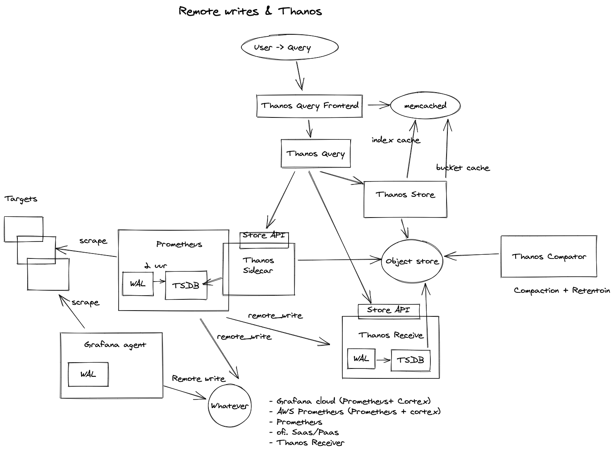
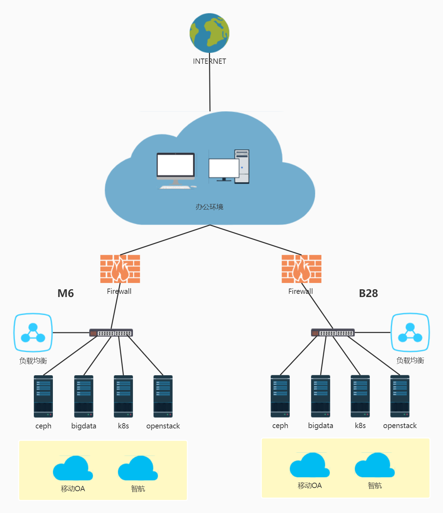

  

   
# Monitor

This projects deploy the prometheus monitor framework. 

# Targets

The monitor target contains:

- Ceph
- K8S
- Openstack
- Zabbix

## Ceph

TODO

## K8S

We deploy the monitor framework base on the following architecture.



1. Each k8s contains promethues+grafana locally, for example: dev k8s、b28 k8s、m6 k8s.
2. Admin cluster contains the global prometheus+grafana.  The global prometheus contains metric for openstack、ceph、zabbix.
3. Each k8s promethues thanos sidecar uploads the metric to OOS(minio)
4. Global grafana select the metric from thanos query which forward the request to thanos-storegateway、each k8s sidecar and local promethues.

### Thanos

it contains minio, query frontend, query and storegateway.  
minio need to add dev-k8s user with 'readwrite,consoleAdmin,diagnostics' policy and create the thanos bucket auto cleanup lifecycle.
```shell
./mc  --insecure ilm add --expiry-days "61" thanos-minio/thanos
```
the ilm can list with the following command:
```shell
./mc --insecure ilm ls thanos-minio/thanos --json
```

### Kube-prometheus-stack

it contains grafana, prometheus-operator, prometheus.

### Links:

1. https://sysrant.com/posts/prometheus-multi-cluster/

## Openstack

TODO

## Zabbix



1、The server reports the operation status through ZABBIX agent, including CPU, memory, hard disk, network status, equipment operation, etc.

2、Ensure the high availability of the server through bond.

3、Routing Switch&Ethernet Switch SNMP reports network status, equipment operation, network congestion,etc.

4、VSU ensures high availability of switch.

5、The loadbalance  ensures high availability of services.

6、The firewall ensures the security and controllability of the data centers B28 and M6.

# Roadmap

* [2022 Roadmap](./docs/roadmap.md)

