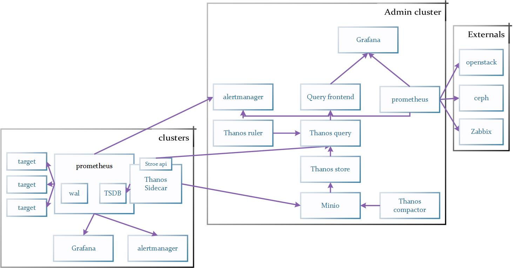

# Monitor Framework

## Architecture

# 

## Explanation

Each k8s has a grafana+prometheus+alertmanager+thanos sidecar, the thanos sidecar store the metrics data into center minio and export the prometheus api for thanos query.

In the admin k8s,  grafana use two datasources: thanos frontend and prometheus(openstack and other systems). thanos frontend backend is thanos query. thanos query split the query by cluster tag. each cluster metric is stored by cluster prometheus in local k8s. thanos sidecar save two days metric and minio store long time metrics for used.

## Problems

1. Grafana use two promethues datasources now, one is used for k8s clusters and another is used for openstack datasources. those prometheus should be exported through thanos.
2. The Node exporter dashboard is splited by two use cases, one for k8s and another is for openstack nodes. we should use the same dashboard for easy operation.